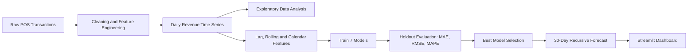

<div align="center">

# ☕ Afficionado Coffee Roasters
### Demand Forecasting & Peak-Hour Analytics for Multi-Store Retail

*An end-to-end time-series project: from raw transactions to a benchmarked model suite and an interactive Streamlit dashboard.*


[Live Demo](#) · [Notebook](Afficionado_Coffee_Forecasting.ipynb) · [Report a Bug](../../issues)

</div>

---

## Table of Contents

1. [Overview](#overview)
2. [Business Problem](#business-problem)
3. [Key Features](#key-features)
4. [Tech Stack](#tech-stack)
5. [Project Workflow](#project-workflow)
6. [Models Benchmarked](#models-benchmarked)
7. [Feature Engineering](#feature-engineering)
8. [Interactive Dashboard](#interactive-dashboard)
9. [Project Structure](#project-structure)
10. [Getting Started](#getting-started)
11. [Evaluation Approach](#evaluation-approach)
12. [Limitations and Roadmap](#limitations-and-roadmap)
13. [Author](#author)

---

## Overview

Afficionado Coffee Roasters operates three New York City locations: **Lower Manhattan**, **Hell's Kitchen**, and **Astoria**. This project turns roughly **149,000 point-of-sale transactions** into a daily demand forecasting system that supports staffing, inventory, and promotion planning.

The work covers the full data science lifecycle:

- Data cleaning, feature engineering, and time-series construction
- Exploratory analysis of revenue, hourly demand, and product categories
- Benchmarking of **seven forecasting models** across statistical, machine learning, and additive-model families
- Recursive **30-day revenue forecasting** with the best-performing model
- Peak-demand detection and store-level / category-level forecasts
- An interactive **Streamlit dashboard** for non-technical stakeholders

---

## Business Problem

Retail coffee demand swings by hour, weekday, and location. Over-staffing and over-ordering waste money; under-staffing loses sales. This project answers four operational questions:

| Question | How the project answers it |
|---|---|
| How much revenue should each store expect over the next 30 days? | Daily revenue forecasting with a gradient-boosted model |
| When are the busiest hours at each store? | Hourly volume analysis and peak-hour detection per location |
| Which days drive the highest demand? | Top-10 peak-day detection on historical data |
| Which forecasting approach is the most reliable? | Head-to-head benchmark of seven models on a time-based holdout |

---

## Key Features

- **Seven-model benchmark** covering naïve, moving average, Holt-Winters, SARIMA, Prophet, Gradient Boosting, and XGBoost
- **Leakage-safe feature pipeline** using lagged values and shifted rolling statistics
- **Time-based train/test split** (last 30 days held out) instead of random sampling
- **Recursive multi-step forecasting** that feeds each prediction back as input for the next day
- **Store-level and category-level forecasts** using Holt-Winters
- **Peak-hour and peak-day analysis** to guide shift planning
- **Four-tab Streamlit dashboard** with store filter, forecast horizon (7 to 30 days), revenue/quantity toggle, and adjustable uncertainty band
- **Model persistence**: metrics, forecasts, and the trained model are exported to disk

---

## Tech Stack

| Category | Tools |
|---|---|
| Language | Python 3.9+ |
| Data Processing | Pandas, NumPy |
| Statistical Modeling | statsmodels (Holt-Winters, SARIMAX) |
| Machine Learning | XGBoost, scikit-learn (Gradient Boosting Regressor) |
| Additive Forecasting | Facebook Prophet |
| Visualization | Matplotlib, Seaborn, Plotly |
| Application | Streamlit |
| Environment | Jupyter Notebook |

---

## Project Workflow



---

## Models Benchmarked

| Family | Model | Configuration |
|---|---|---|
| Baseline | Naïve Forecast | Last observed value carried forward |
| Baseline | Moving Average | 7-day window |
| Statistical | Holt-Winters Exponential Smoothing | Additive trend and seasonality, period = 7 |
| Statistical | SARIMA | (1,1,1)(1,1,0)[7] |
| Additive | Facebook Prophet | Weekly seasonality, changepoint prior 0.05 |
| Machine Learning | Gradient Boosting Regressor | 300 estimators, depth 4, learning rate 0.05 |
| Machine Learning | **XGBoost** | 300 estimators, depth 4, learning rate 0.05, subsample 0.8, column sample 0.8 |

---

## Feature Engineering

Supervised features are built from the daily revenue series so the tree-based models can learn temporal patterns:

- **Lag features:** revenue at t-1, t-2, t-3, t-7, t-14
- **Rolling statistics:** mean and standard deviation over 3, 7, and 14-day windows (computed on shifted data to prevent leakage)
- **Calendar features:** day of week, month, ISO week, weekend flag
- **Transaction-level features:** hour of day, revenue per line item (quantity × unit price)

---

## Interactive Dashboard

The Streamlit app (`app.py`) presents the results in an espresso-themed interface designed for business users.

| Tab | What it shows |
|---|---|
| **Sales Forecast** | Historical vs. forecast line chart, uncertainty band, 7-day rolling trend, forecast distribution |
| **Hourly Heatmaps** | Projected hourly demand by day and hour, plus peak-hour summary per store |
| **Store Comparison** | Overlaid store forecasts, revenue share donut, stacked daily breakdown, performance summary table |
| **Model Rankings** | Radar chart, accuracy and error bars, full leaderboard, error-vs-accuracy scatter |

**Sidebar controls:** store selector, forecast horizon slider (7 to 30 days), revenue or quantity metric, and uncertainty band width.

---

## Project Structure

```text
.
├── Afficionado_Coffee_Forecasting.ipynb   # Full analysis, modeling, and evaluation
├── app.py                                 # Streamlit dashboard
├── requirements.txt                       # Python dependencies
├── data.csv                               # Transaction data (add locally, not tracked)
└── afficionado_outputs/                   # Generated by the notebook
    ├── model_metrics.csv
    ├── future_forecast_30days.csv
    └── best_model.pkl
```

---

## Getting Started

### 1. Clone the repository

```bash
git clone https://github.com/<your-username>/<your-repo>.git
cd <your-repo>
```

### 2. Create a virtual environment and install dependencies

```bash
python -m venv venv
source venv/bin/activate        # Windows: venv\Scripts\activate
pip install -r requirements.txt
```

### 3. Run the dashboard

```bash
streamlit run app.py
```

The app opens at `http://localhost:8501`.

### 4. Reproduce the analysis

Place the transaction dataset in the project root as `data.csv`, then launch the notebook:

```bash
jupyter notebook Afficionado_Coffee_Forecasting.ipynb
```

Expected columns: `transaction_id`, `transaction_time`, `transaction_qty`, `store_location`, `product_category`, `unit_price`.

---

## Evaluation Approach

- **Split:** chronological. The final 30 days are held out as the test set; all earlier days are used for training.
- **Metrics:** Mean Absolute Error (MAE), Root Mean Squared Error (RMSE), and Mean Absolute Percentage Error (MAPE).
- **Selection:** the best model is chosen on holdout performance, retrained on the full history, and used to forecast the next 30 days.
- **Operational KPIs:** peak-demand capture rate (share of days forecast within ±15% of actual) and total revenue forecast error.

---

## Limitations and Roadmap

Being upfront about scope makes the results easier to trust and extend.

**Current limitations**

- Calendar dates are reconstructed from transaction ordering across a six-month window, so true holiday and weather effects are not captured.
- Six months of history cannot support yearly seasonality.
- The dashboard uses embedded forecast outputs and simulated supporting data (historical series, hourly heatmap, store split) for demonstration. It is not yet connected to live model inference.
- Uncertainty bands are heuristic percentage bands, not model-derived prediction intervals.

**Roadmap**

- [ ] Add rolling-origin (walk-forward) cross-validation
- [ ] Replace heuristic bands with quantile regression or conformal prediction intervals
- [ ] Add exogenous features: holidays, weather, promotions
- [ ] Train store-level XGBoost models instead of splitting the aggregate forecast
- [ ] Load the saved model inside the dashboard for live inference
- [ ] Containerize with Docker and deploy to Streamlit Community Cloud

---

## Author

**Sarfaraz Ali**


<div align="center">

*If you found this project useful, consider giving it a ⭐*

</div>
